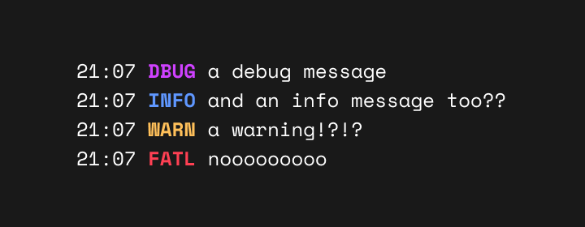

# lg


# usage
add the package to your project
```
go get https://github.com/sophed/lg
```

the following functions will then be available
```go
package main

import "github.com/sophed/lg"

func main() {
	lg.Dbug("a debug message")
	lg.Info("and an info message too??")
	lg.Warn("a warning!?!?")
	lg.Fatl("nooooooooo")
}
```
that's it, literally nothing else

# why not stdlib?
by default, the Go `log` package doesn't have the nicest formatting and while it is possible to edit, it's an (albeit minor) annoyance every time i make a new go project.

also [charmbracelet/log] has a bunch of stuff i don't use
